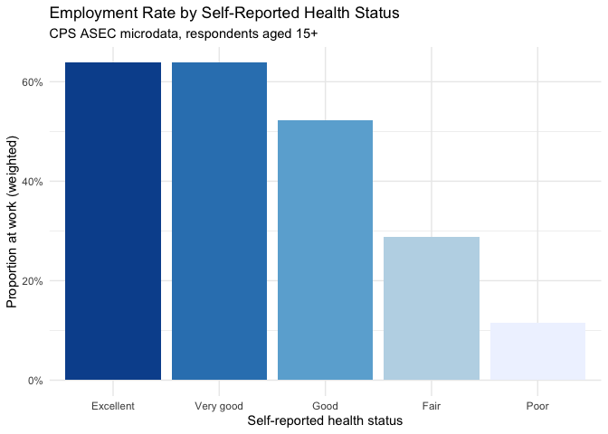
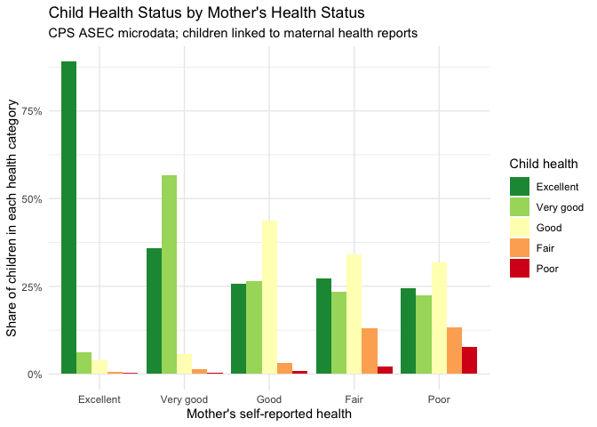

IPUMS CPS Microdata: Health, Employment, and Household Analysis
================
Olivia Bonnette
2026-05-10

- [Overview](#overview)
- [Setup](#setup)
- [Data](#data)
- [Part 1: Food Stamp Receipt](#part-1-food-stamp-receipt)
  - [Weighted person-level count](#weighted-person-level-count)
  - [Proportion receiving food stamps
    (person-level)](#proportion-receiving-food-stamps-person-level)
  - [Household-level count and
    proportion](#household-level-count-and-proportion)
- [Part 2: Health Status and
  Employment](#part-2-health-status-and-employment)
  - [Employment rate by health
    status](#employment-rate-by-health-status)
  - [Average hours worked by health
    status](#average-hours-worked-by-health-status)
  - [Visualization: Health status and
    employment](#visualization-health-status-and-employment)
- [Part 3: Spouse Characteristics and Age Gap
  Analysis](#part-3-spouse-characteristics-and-age-gap-analysis)
  - [Age gap between spouses](#age-gap-between-spouses)
- [Part 4: Disability and Marital
  Status](#part-4-disability-and-marital-status)
  - [Prevalence of hearing and vision
    difficulties](#prevalence-of-hearing-and-vision-difficulties)
  - [Marriage rates and spousal disability among deaf
    respondents](#marriage-rates-and-spousal-disability-among-deaf-respondents)
- [Part 5: Intergenerational Health
  Correlation](#part-5-intergenerational-health-correlation)
  - [Child health by mother’s health
    status](#child-health-by-mothers-health-status)
- [Packages Used](#packages-used)

## Overview

This lab uses **IPUMS Current Population Survey (CPS) microdata** to
analyze the relationships between health status, employment, food stamp
receipt, and household characteristics. All estimates use **ASEC survey
weights** to produce population-representative statistics.

Working with CPS microdata requires careful attention to: - Survey
weight application for accurate population estimates - Universe
restrictions (which respondents were asked each question) - Labeled
variable handling via the `haven` and `ipumsr` packages - Potential
reporting bias when survey respondents report on themselves and
household members

------------------------------------------------------------------------

## Setup

``` r
library(dplyr)    # data manipulation
library(haven)    # read labeled Stata files
library(ipumsr)   # IPUMS-specific data handling
library(ggplot2)  # visualization
```

------------------------------------------------------------------------

## Data

``` r
# Load CPS ASEC microdata
# Ensure cps_data.dta is in your working directory
df <- read_dta("cps_data (1).dta")

# Standardize labeled variables to numeric for analysis
df_clean <- df %>%
  mutate(
    foodstmp_num = as.numeric(as_factor(foodstmp)),
    health_num   = as.numeric(as_factor(health)),
    empstat_num  = as.numeric(as_factor(empstat))
  )
```

**Variable coding notes:**

| Variable | Coding |
|----|----|
| `foodstmp` | 1 = does not receive food stamps; 2 = receives food stamps |
| `health` | 1 = Excellent, 2 = Very good, 3 = Good, 4 = Fair, 5 = Poor |
| `empstat` | Categorical employment status; “At work” is the relevant category |
| `asecwt` | Person-level ASEC survey weight |
| `asecwth` | Household-level ASEC survey weight |

------------------------------------------------------------------------

## Part 1: Food Stamp Receipt

### Weighted person-level count

``` r
df_clean %>%
  summarize(
    num_foodstamps = sum(asecwt[foodstmp_num == 2], na.rm = TRUE)
  )
```

    ## # A tibble: 1 × 1
    ##   num_foodstamps
    ##            <dbl>
    ## 1     537069647.

Approximately **537 million person-weight units** received food stamps
in the survey year. This is the sum of person weights for food stamp
recipients — interpreted as a population estimate of the total number of
Americans receiving food stamps.

### Proportion receiving food stamps (person-level)

``` r
df_clean %>%
  summarize(
    prop_foodstamps = weighted.mean(foodstmp_num == 2, asecwt, na.rm = TRUE)
  )
```

    ## # A tibble: 1 × 1
    ##   prop_foodstamps
    ##             <dbl>
    ## 1           0.879

Approximately **87.9%** of the weighted person sample received food
stamps. This high share likely reflects the universe of the question —
the ASEC food stamp question may be restricted to households in lower
income ranges or specific demographic groups rather than the full
population. Universe restrictions in CPS microdata are critical to
interpret before drawing conclusions.

### Household-level count and proportion

``` r
# Filter to one person per household using pernum == 1
df_clean %>%
  filter(pernum == 1) %>%
  summarize(
    num_households    = sum(asecwth[foodstmp_num == 2], na.rm = TRUE),
    prop_households   = weighted.mean(foodstmp_num == 2, asecwth, na.rm = TRUE)
  )
```

    ## # A tibble: 1 × 2
    ##   num_households prop_households
    ##            <dbl>           <dbl>
    ## 1     214515477.           0.899

At the household level, approximately **214 million household-weight
units** (89.9% of the weighted household sample) received food stamps.
Again, the universe restriction explanation applies.

------------------------------------------------------------------------

## Part 2: Health Status and Employment

### Employment rate by health status

The universe for `empstat` is respondents aged 15 and older. We restrict
to this group for all employment analyses.

``` r
df2 <- df %>%
  mutate(
    health_f  = as_factor(health),
    empstat_f = as_factor(empstat),
    at_work   = empstat_f == "At work"
  )

df2 %>%
  filter(age >= 15) %>%
  group_by(health_f) %>%
  summarize(
    pct_at_work = weighted.mean(at_work, asecwt, na.rm = TRUE)
  )
```

    ## # A tibble: 5 × 2
    ##   health_f  pct_at_work
    ##   <fct>           <dbl>
    ## 1 Excellent       0.638
    ## 2 Very good       0.638
    ## 3 Good            0.522
    ## 4 Fair            0.288
    ## 5 Poor            0.115

**Key finding:** Employment rates decline sharply and monotonically as
self-reported health deteriorates. Respondents reporting excellent or
very good health worked at roughly 63–64%, while those reporting poor
health worked at only 11.5%.

### Average hours worked by health status

``` r
df2 %>%
  mutate(hours = as.numeric(ahrsworkt)) %>%
  filter(age >= 15, hours < 999) %>%  # 999 = not in universe / missing
  group_by(health_f) %>%
  summarize(
    avg_hours = weighted.mean(hours, asecwt, na.rm = TRUE)
  )
```

    ## # A tibble: 5 × 2
    ##   health_f  avg_hours
    ##   <fct>         <dbl>
    ## 1 Excellent      38.4
    ## 2 Very good      38.6
    ## 3 Good           37.6
    ## 4 Fair           35.6
    ## 5 Poor           32.3

**Key finding:** Workers in poor health average roughly 32 hours per
week versus 38–39 for those in excellent or very good health — a
meaningful gap that compounds the lower employment rate among less
healthy respondents.

### Visualization: Health status and employment

``` r
emp_summary <- df2 %>%
  filter(age >= 15) %>%
  group_by(health_f) %>%
  summarize(pct_at_work = weighted.mean(at_work, asecwt, na.rm = TRUE))

ggplot(emp_summary, aes(x = health_f, y = pct_at_work, fill = health_f)) +
  geom_col(show.legend = FALSE) +
  scale_y_continuous(labels = scales::percent_format()) +
  scale_fill_brewer(palette = "Blues", direction = -1) +
  labs(
    title    = "Employment Rate by Self-Reported Health Status",
    subtitle = "CPS ASEC microdata, respondents aged 15+",
    x        = "Self-reported health status",
    y        = "Proportion at work (weighted)"
  ) +
  theme_minimal()
```

<!-- -->

------------------------------------------------------------------------

## Part 3: Spouse Characteristics and Age Gap Analysis

### Age gap between spouses

We calculate the age difference (husband minus wife) among married men
aged 15+.

``` r
df2 <- df %>%
  mutate(
    age_diff = ifelse(
      sex == 1 & marst %in% c(1, 2),
      age - age_sp,
      NA
    )
  )

# Overall mean age gap
df2 %>%
  summarize(mean_all_married = weighted.mean(age_diff, asecwt, na.rm = TRUE))
```

    ## # A tibble: 1 × 1
    ##   mean_all_married
    ##              <dbl>
    ## 1             2.27

``` r
# Age gap among men under 30
df2 %>%
  filter(age <= 30) %>%
  summarize(mean_under30 = weighted.mean(age_diff, asecwt, na.rm = TRUE))
```

    ## # A tibble: 1 × 1
    ##   mean_under30
    ##          <dbl>
    ## 1       -0.161

``` r
# Age gap among men over 50
df2 %>%
  filter(age >= 50) %>%
  summarize(mean_over50 = weighted.mean(age_diff, asecwt, na.rm = TRUE))
```

    ## # A tibble: 1 × 1
    ##   mean_over50
    ##         <dbl>
    ## 1        3.23

**Key finding:** The average spousal age gap is approximately **2.3
years** (husband older). Among men under 30, the gap is nearly zero
(−0.16 years), while men over 50 show a gap of 3.2 years. This pattern
is consistent with assortative mating patterns that shift across birth
cohorts.

------------------------------------------------------------------------

## Part 4: Disability and Marital Status

### Prevalence of hearing and vision difficulties

``` r
df2 <- df %>%
  mutate(
    diffhear_num    = as.numeric(as_factor(diffhear)),
    diffeye_num     = as.numeric(as_factor(diffeye)),
    diffhear_sp_num = as.numeric(as_factor(diffhear_sp)),
    marst_num       = as.numeric(as_factor(marst))
  )

# Proportion with hearing difficulty (among those in universe)
df2 %>%
  filter(diffhear_num != 0) %>%
  summarize(pct_deaf = weighted.mean(diffhear_num == 2, asecwt, na.rm = TRUE))
```

    ## # A tibble: 1 × 1
    ##   pct_deaf
    ##      <dbl>
    ## 1    0.772

``` r
# Proportion with vision difficulty
df2 %>%
  filter(diffeye_num != 0) %>%
  summarize(pct_blind = weighted.mean(diffeye_num == 2, asecwt, na.rm = TRUE))
```

    ## # A tibble: 1 × 1
    ##   pct_blind
    ##       <dbl>
    ## 1     0.783

Approximately 77% of those in the hearing difficulty universe reported
hearing difficulty; 78% of those in the vision difficulty universe
reported vision difficulty. These high shares again suggest universe
restrictions are limiting the denominator to at-risk or older
populations.

### Marriage rates and spousal disability among deaf respondents

``` r
# Marriage rate among deaf respondents
df2 %>%
  filter(diffhear_num == 2) %>%
  summarize(pct_married_sp = weighted.mean(marst_num == 1, asecwt, na.rm = TRUE))
```

    ## # A tibble: 1 × 1
    ##   pct_married_sp
    ##            <dbl>
    ## 1          0.497

``` r
# Proportion of deaf respondents married to a deaf spouse
df2 %>%
  filter(diffhear_num == 2) %>%
  mutate(spouse_deaf = diffhear_sp_num == 2) %>%
  summarize(pct_deaf_couple = weighted.mean(spouse_deaf, asecwt, na.rm = TRUE))
```

    ## # A tibble: 1 × 1
    ##   pct_deaf_couple
    ##             <dbl>
    ## 1           0.968

**Key finding:** Among deaf respondents who are married, approximately
**96.8%** have a spouse who is also deaf — a striking pattern consistent
with strong assortative mating on disability status.

------------------------------------------------------------------------

## Part 5: Intergenerational Health Correlation

### Child health by mother’s health status

``` r
data_summary <- df %>%
  filter(!is.na(health_mom)) %>%
  group_by(
    health     = as_factor(health),
    health_mom = as_factor(health_mom)
  ) %>%
  summarize(n = sum(asecwt), .groups = "drop") %>%
  group_by(health_mom) %>%
  mutate(pct = n / sum(n))

ggplot(data_summary,
       aes(x = health_mom, y = pct, fill = health)) +
  geom_col(position = "dodge") +
  scale_y_continuous(labels = scales::percent_format()) +
  scale_fill_brewer(palette = "RdYlGn", direction = -1) +
  labs(
    title    = "Child Health Status by Mother's Health Status",
    subtitle = "CPS ASEC microdata; children linked to maternal health reports",
    x        = "Mother's self-reported health",
    y        = "Share of children in each health category",
    fill     = "Child health"
  ) +
  theme_minimal()
```

<!-- -->

**Key finding:** Children of mothers in excellent health are
overwhelmingly rated in excellent health themselves, while children of
mothers in poor health show a much wider distribution of health
outcomes. The correlation is visually striking and monotonic.

**Critical caveat:** Both child and mother health are **self-reported by
the same survey respondent** (the mother). This creates reporting bias:
a mother who perceives her own health as poor may also perceive her
child’s health as poor, inflating the observed correlation beyond what
objective measurement would show. Causal inference requires independent
measurement of outcomes.

------------------------------------------------------------------------

## Packages Used

- `dplyr`: Data manipulation with weighted `summarize()` operations
- `haven`: Import labeled Stata `.dta` files and convert factor labels
- `ipumsr`: IPUMS-specific DDI codebook handling
- `ggplot2`: Data visualization with `geom_col()` and
  `scale_fill_brewer()`
