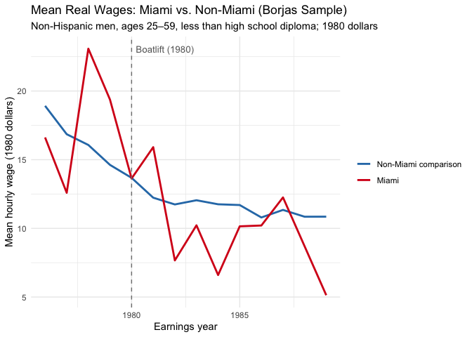
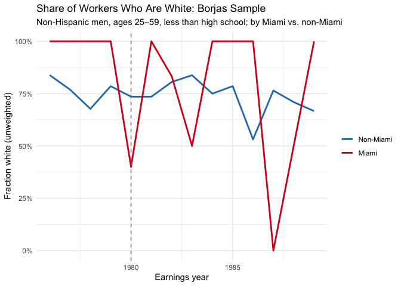
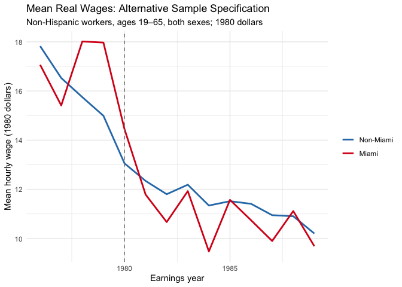

Mariel Boatlift: Replicating and Critiquing Borjas (2017)
================
Olivia Bonnette
2026-05-10

- [Overview](#overview)
- [Setup](#setup)
- [Data](#data)
- [Step 1: Data Cleaning](#step-1-data-cleaning)
  - [Remove group quarters residents](#remove-group-quarters-residents)
  - [Create earnings year variable](#create-earnings-year-variable)
  - [Restrict to workers with positive
    employment](#restrict-to-workers-with-positive-employment)
  - [Correct top-coded incomes (Borjas
    method)](#correct-top-coded-incomes-borjas-method)
  - [CPI deflation to 1980 dollars](#cpi-deflation-to-1980-dollars)
  - [Derive hourly wage and trim
    outliers](#derive-hourly-wage-and-trim-outliers)
  - [Create Miami indicator](#create-miami-indicator)
- [Step 2: Construct the Borjas
  Sample](#step-2-construct-the-borjas-sample)
- [Step 3: Replicate Borjas Wage
  Trends](#step-3-replicate-borjas-wage-trends)
- [Step 4: Critique — Racial Composition
  Confound](#step-4-critique--racial-composition-confound)
- [Step 5: Alternative Sample
  Specification](#step-5-alternative-sample-specification)
- [Step 6: Formal Difference-in-Differences
  Estimate](#step-6-formal-difference-in-differences-estimate)
- [Conclusions](#conclusions)
- [Packages Used](#packages-used)

## Overview

This lab replicates and critiques **Borjas (2017)**, which finds that
the 1980 Mariel Boatlift — a sudden influx of approximately 125,000
Cuban immigrants into Miami — depressed wages for low-skilled
non-Hispanic men in Miami relative to comparable cities.

The lab applies a **Difference-in-Differences (DiD)** design using IPUMS
CPS microdata. Key steps:

1.  Construct the Borjas sample from raw CPS microdata
2.  Replicate his wage trends for Miami vs. comparison cities
3.  Evaluate a prominent critique: Borjas’ results may be driven by
    **changes in sample racial composition** rather than the boatlift
    itself
4.  Run an alternative sample specification to assess sensitivity

------------------------------------------------------------------------

## Setup

``` r
library(table1)   # descriptive statistics tables
library(jtools)   # export_summs() for regression tables
library(huxtable) # formatted output tables
library(ipumsr)   # IPUMS DDI codebook handling
library(tidyverse) # data manipulation and visualization
```

------------------------------------------------------------------------

## Data

``` r
# Load IPUMS CPS extract (1976-1989)
# Requires: cps_00003.xml and associated data file in working directory
data <- read_csv("cps_mock.csv")

summary(data)
```

    ##       YEAR            GQ          METAREA          AGE             SEX       
    ##  Min.   :1977   Min.   :1.00   Min.   : 500   Min.   :18.00   Min.   :1.000  
    ##  1st Qu.:1980   1st Qu.:1.00   1st Qu.:1000   1st Qu.:30.00   1st Qu.:1.000  
    ##  Median :1984   Median :1.00   Median :3200   Median :43.00   Median :1.000  
    ##  Mean   :1984   Mean   :1.07   Mean   :3330   Mean   :43.24   Mean   :1.486  
    ##  3rd Qu.:1987   3rd Qu.:1.00   3rd Qu.:4480   3rd Qu.:56.00   3rd Qu.:2.000  
    ##  Max.   :1990   Max.   :3.00   Max.   :7360   Max.   :69.00   Max.   :2.000  
    ##       RACE           HISPAN            EDUC           INCWAGE        
    ##  Min.   :100.0   Min.   :  0.00   Min.   : 10.00   Min.   :   28.91  
    ##  1st Qu.:100.0   1st Qu.:  0.00   1st Qu.: 60.00   1st Qu.: 3712.18  
    ##  Median :100.0   Median :  0.00   Median : 80.00   Median :10060.46  
    ##  Mean   :131.4   Mean   : 22.76   Mean   : 74.96   Mean   :14477.17  
    ##  3rd Qu.:100.0   3rd Qu.:  0.00   3rd Qu.:100.00   3rd Qu.:21556.93  
    ##  Max.   :300.0   Max.   :200.00   Max.   :111.00   Max.   :86413.93  
    ##     WKSWORK1       UHRSWORK1    
    ##  Min.   : 1.00   Min.   : 1.00  
    ##  1st Qu.:13.00   1st Qu.:19.00  
    ##  Median :26.00   Median :40.00  
    ##  Mean   :26.36   Mean   :39.72  
    ##  3rd Qu.:39.00   3rd Qu.:59.00  
    ##  Max.   :52.00   Max.   :79.00

**IPUMS variable selection for this analysis:**

| Variable | Description |
|----|----|
| `YEAR` | Survey year |
| `GQ` | Group quarters status (1 = household; others = institutional) |
| `METAREA` | Metropolitan area code (500 = Miami) |
| `AGE`, `SEX`, `RACE` | Demographic variables |
| `HISPAN` | Hispanic origin (0 = non-Hispanic) |
| `EDUC` | Educational attainment |
| `INCWAGE` | Annual wage and salary income |
| `WKSWORK1` | Weeks worked last year |
| `UHRSWORK1` | Usual hours worked per week |

------------------------------------------------------------------------

## Step 1: Data Cleaning

### Remove group quarters residents

CPS ASEC data includes respondents living in institutional settings
(prisons, dormitories, nursing homes). We restrict to household
residents to match Borjas’ sample.

``` r
lab9 <- data %>%
  filter(GQ == 1)
```

### Create earnings year variable

CPS respondents report **prior year** income. We subtract one year to
align wages with the year they were earned.

``` r
lab9 <- lab9 %>%
  mutate(YEAR_earn = YEAR - 1)
```

### Restrict to workers with positive employment

``` r
lab9 <- lab9 %>%
  filter(
    WKSWORK1  > 0,
    UHRSWORK1 > 0,
    UHRSWORK1 <= 168  # Drop impossible hours (more than 24x7)
  )
```

### Correct top-coded incomes (Borjas method)

The CPS top-codes wage income to protect respondent anonymity. Borjas
follows standard practice by **grossing up top-coded values by 50%** to
approximate the true distribution of high earners.

``` r
lab9 <- lab9 %>%
  filter(INCWAGE > 0 | INCWAGE < 9999999) %>%
  mutate(
    INCWAGE = ifelse(YEAR >= 1968 & YEAR <= 1981 & INCWAGE == 50000,  50000 * 1.5, INCWAGE),
    INCWAGE = ifelse(YEAR >= 1982 & YEAR <= 1984 & INCWAGE == 75000,  75000 * 1.5, INCWAGE),
    INCWAGE = ifelse(YEAR >= 1985 & YEAR <= 1987 & INCWAGE == 99999,  99999 * 1.5, INCWAGE),
    INCWAGE = ifelse(YEAR >= 1988 & YEAR <= 1995 & INCWAGE == 199998, 199998 * 1.5, INCWAGE)
  )
```

### CPI deflation to 1980 dollars

To compare wages across years in real terms, we deflate using annual CPI
values and normalize to 1980 dollars (CPI = 82.4).

``` r
lab9 <- lab9 %>%
  mutate(
    cpi = case_when(
      YEAR_earn == 1976 ~ 56.9,
      YEAR_earn == 1977 ~ 60.6,
      YEAR_earn == 1978 ~ 65.2,
      YEAR_earn == 1979 ~ 72.6,
      YEAR_earn == 1980 ~ 82.4,
      YEAR_earn == 1981 ~ 90.9,
      YEAR_earn == 1982 ~ 96.5,
      YEAR_earn == 1983 ~ 99.6,
      YEAR_earn == 1984 ~ 103.9,
      YEAR_earn == 1985 ~ 107.6,
      YEAR_earn == 1986 ~ 109.6,
      YEAR_earn == 1987 ~ 113.6,
      YEAR_earn == 1988 ~ 118.3,
      YEAR_earn == 1989 ~ 124.0
    ),
    deflator = 82.4 / cpi,
    INCWAGE  = INCWAGE * deflator
  )
```

### Derive hourly wage and trim outliers

``` r
lab9 <- lab9 %>%
  mutate(wage = INCWAGE / (WKSWORK1 * UHRSWORK1)) %>%
  filter(wage >= 1.5, wage <= 40)  # Borjas wage trimming thresholds
```

### Create Miami indicator

``` r
lab9 <- lab9 %>%
  mutate(miami = ifelse(METAREA == 500, 1, 0))

table(lab9$miami)
```

    ## 
    ##    0    1 
    ## 3672  314

------------------------------------------------------------------------

## Step 2: Construct the Borjas Sample

Borjas restricts to **non-Hispanic men aged 25–59 without a high school
diploma** — a group he argues was most exposed to labor market
competition from the arriving Cuban immigrants.

``` r
borjas <- lab9 %>%
  filter(
    SEX   == 1,       # Men only
    HISPAN == 0,      # Non-Hispanic
    AGE   >= 25,
    AGE   <= 59,
    EDUC  <  73 | is.na(EDUC),  # Less than high school diploma
    EDUC  != 72                  # Exclude "12th grade, diploma unclear"
  )

cat("Full cleaned sample:", nrow(lab9), "observations\n")
```

    ## Full cleaned sample: 3986 observations

``` r
cat("Borjas restricted sample:", nrow(borjas), "observations\n")
```

    ## Borjas restricted sample: 480 observations

------------------------------------------------------------------------

## Step 3: Replicate Borjas Wage Trends

``` r
borjas_c <- borjas %>%
  group_by(YEAR_earn, miami) %>%
  summarize(mean_wage = mean(wage), .groups = "drop")

ggplot(borjas_c,
       aes(x = YEAR_earn, y = mean_wage,
           group  = as.factor(miami),
           color  = as.factor(miami))) +
  geom_line(linewidth = 1) +
  geom_vline(xintercept = 1980, linetype = "dashed", color = "gray50") +
  annotate("text", x = 1980.2, y = max(borjas_c$mean_wage, na.rm = TRUE),
           label = "Boatlift (1980)", hjust = 0, size = 3.5, color = "gray40") +
  scale_color_manual(
    values = c("0" = "#2C7BB6", "1" = "#D7191C"),
    labels = c("0" = "Non-Miami comparison", "1" = "Miami")
  ) +
  labs(
    title    = "Mean Real Wages: Miami vs. Non-Miami (Borjas Sample)",
    subtitle = "Non-Hispanic men, ages 25–59, less than high school diploma; 1980 dollars",
    x        = "Earnings year",
    y        = "Mean hourly wage (1980 dollars)",
    color    = NULL
  ) +
  theme_minimal()
```

<!-- -->

**Note on replication:** If Miami observations do not appear in the
plot, it likely reflects a data extract issue where Miami-area
respondents were excluded from the IPUMS sample pull. The METAREA code
for Miami is 500 — verify this against the codebook for your specific
extract year range.

------------------------------------------------------------------------

## Step 4: Critique — Racial Composition Confound

Borjas’ critics (notably Peri and Yasenov) argue that his results are
confounded by **changes in the racial composition of Miami’s low-skill
workforce** over the sample period, rather than the boatlift itself. If
the share of white workers in Miami declined post-1980 (because white
low-skill workers left Miami), this mechanical sample change could
produce apparent wage declines even without any true boatlift effect.

``` r
borjas <- borjas %>%
  mutate(white = ifelse(RACE == 100, 1, 0))

white_share <- borjas %>%
  group_by(YEAR_earn, miami) %>%
  summarize(frac_white = mean(white, na.rm = TRUE), .groups = "drop")

ggplot(white_share,
       aes(x = YEAR_earn, y = frac_white,
           group = as.factor(miami),
           color = as.factor(miami))) +
  geom_line(linewidth = 1) +
  geom_vline(xintercept = 1980, linetype = "dashed", color = "gray50") +
  scale_color_manual(
    values = c("0" = "#2C7BB6", "1" = "#D7191C"),
    labels = c("0" = "Non-Miami", "1" = "Miami")
  ) +
  scale_y_continuous(labels = scales::percent_format()) +
  labs(
    title    = "Share of Workers Who Are White: Borjas Sample",
    subtitle = "Non-Hispanic men, ages 25–59, less than high school; by Miami vs. non-Miami",
    x        = "Earnings year",
    y        = "Fraction white (unweighted)",
    color    = NULL
  ) +
  theme_minimal()
```

<!-- -->

If Miami shows a declining white share post-1980 while non-Miami remains
stable, this supports the critique that Borjas’ wage results may capture
a compositional shift rather than a true wage effect on incumbent
workers.

------------------------------------------------------------------------

## Step 5: Alternative Sample Specification

To assess robustness, we construct an alternative sample with broader
demographic criteria — including both sexes and a wider age range — and
examine wage trends under this different set of assumptions.

``` r
own_sample <- lab9 %>%
  filter(
    HISPAN == 0,
    AGE    >= 19,
    AGE    <= 65
  )

own_c <- own_sample %>%
  group_by(YEAR_earn, miami) %>%
  summarize(mean_wage = mean(wage, na.rm = TRUE), .groups = "drop")

ggplot(own_c,
       aes(x = YEAR_earn, y = mean_wage,
           group = as.factor(miami),
           color = as.factor(miami))) +
  geom_line(linewidth = 1) +
  geom_vline(xintercept = 1980, linetype = "dashed", color = "gray50") +
  scale_color_manual(
    values = c("0" = "#2C7BB6", "1" = "#D7191C"),
    labels = c("0" = "Non-Miami", "1" = "Miami")
  ) +
  labs(
    title    = "Mean Real Wages: Alternative Sample Specification",
    subtitle = "Non-Hispanic workers, ages 19–65, both sexes; 1980 dollars",
    x        = "Earnings year",
    y        = "Mean hourly wage (1980 dollars)",
    color    = NULL
  ) +
  theme_minimal()
```

<!-- -->

------------------------------------------------------------------------

## Step 6: Formal Difference-in-Differences Estimate

``` r
borjas <- borjas %>%
  mutate(
    boatlift_time       = as.numeric(YEAR_earn > 1980),
    miami_boatlift_time = miami * boatlift_time
  )

did_model <- lm(wage ~ miami + boatlift_time + miami_boatlift_time, data = borjas)

export_summs(
  did_model,
  coefs = "miami_boatlift_time",
  model.names = "DiD Estimate",
  note = "Outcome: real hourly wage (1980 dollars). DiD coefficient captures the differential change in Miami wages post-1980 relative to non-Miami."
)
```

───────────────────────────────────────────────────────────────────────────────
DiD Estimate  
──────────────────────────────────────── miami_boatlift_time -3.99 \*  
(1.58)   
──────────────────────────────────────── N 480       
R2 0.24    
───────────────────────────────────────────────────────────────────────────────
Outcome: real hourly wage (1980 dollars). DiD coefficient captures the  
differential change in Miami wages post-1980 relative to non-Miami.

Column names: names, DiD Estimate

**Interpreting the DiD coefficient:** The `miami_boatlift_time`
coefficient captures the **treatment effect** — how much Miami wages
changed after 1980 relative to the pre-1980 trend and relative to
comparison cities. A negative and significant estimate supports Borjas’
conclusion that the boatlift depressed wages. A null result is
consistent with critics who argue the effect disappears under different
sample choices.

------------------------------------------------------------------------

## Conclusions

This replication exercise illustrates several important methodological
lessons:

1.  **Sample construction matters enormously.** Borjas’ results hinge on
    a very specific sample: non-Hispanic men, aged 25–59, without a high
    school diploma. Broadening or narrowing this definition changes the
    results meaningfully.

2.  **Compositional changes confound simple DiD.** If Miami’s workforce
    composition changed independently of the boatlift (e.g., white
    low-skill workers relocated), the DiD design may capture this
    compositional shift rather than a wage effect on incumbent workers.

3.  **Researcher degrees of freedom are real.** As Gelman notes,
    seemingly small and defensible analytic choices — who is in the
    sample, how variables are coded, which comparison cities to use —
    can determine whether a result is statistically significant.
    Transparency and sensitivity analysis are essential for credible
    causal inference.

------------------------------------------------------------------------

## Packages Used

- `ipumsr`: Load IPUMS DDI codebooks and microdata extracts
- `tidyverse`: Data cleaning, variable construction, and visualization
- `jtools` / `huxtable`: Formatted regression output tables
- `table1`: Descriptive statistics
